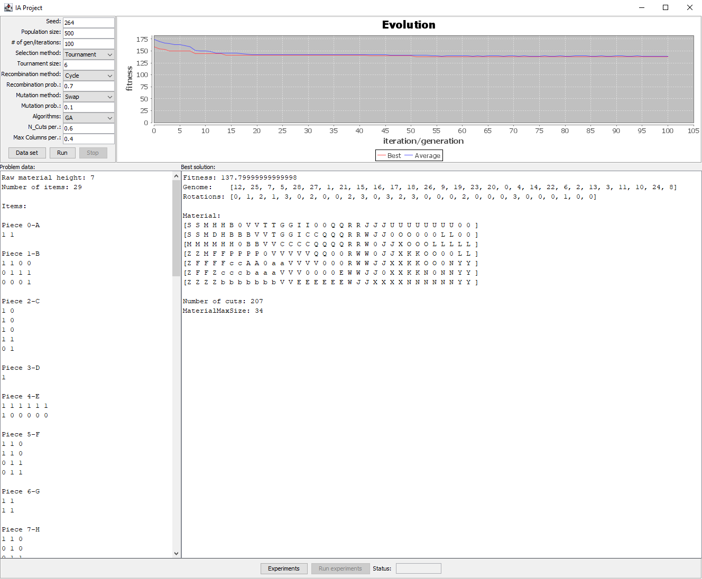

# Two-Dimensional Cutting Stock Problem

This repository contains a genetic algorithm approach to try and solve a two-dimensional cutting stock problem I developed for one of my classes during my computer engineering degree.

 

 

---

## Individual
Each individual is represented by a sequence of pieces and the rotation associated with each piece.

**Example:**

| Sequence     | 4     | 5     | 3     | 6     | 2     | 1     |
| :----------- | :---- | :---- | :---- | :---- | :---- | :---- |
| **Rotation** | **0** | **2** | **1** | **2** | **0** | **1** |

As shown in the example, piece number **4** was rotated **zero** times to the right, piece number **5** was rotated **twice** to the right, piece number **3**  was rotated **once** to the right, etc ...

**Note:** Rotations are represented by a number, this number indicates the amount of times that piece was rotated **90 degrees to the right**.

## Population
After the dataset file is read the initial population is created, this population consists of x random individuals each one with a random piece sequence and each piece with a random rotation.

After each generation, the population's individuals might get recombined or even mutated creating new individuals, the best individuals are then chosen for the next generation.

**Note:** The dataset file contains the number of pieces, each piece's representation and the maximum height of the material

## Operators
### Selection
- **Tournament**
- **Roulette Wheel** (not used due to this problem being a minimization problem)

### Recombination
- **Cycle** (*CX*)
- **Crossover** (*OX1*)
- **Partially Mapped** (*PMX*)

### Mutation
- **Swap**
- **Insert**
- **Inversion**

## Fitness Function
The implemented fitness function starts by filling the material with each piece in the sequence with the correct piece rotation, then, the number of cuts needed to extract each piece from the material is counted.

In the end the individual's fitness is returned, this fitness is calculated using the **material length needed** and the **number of cuts**.

**Note** - to place each piece two loops were created, the first one iterates from the left to the right and the second one iterates from the top to the bottom of the material, this assures that each piece is placed at the top-left most position possible.